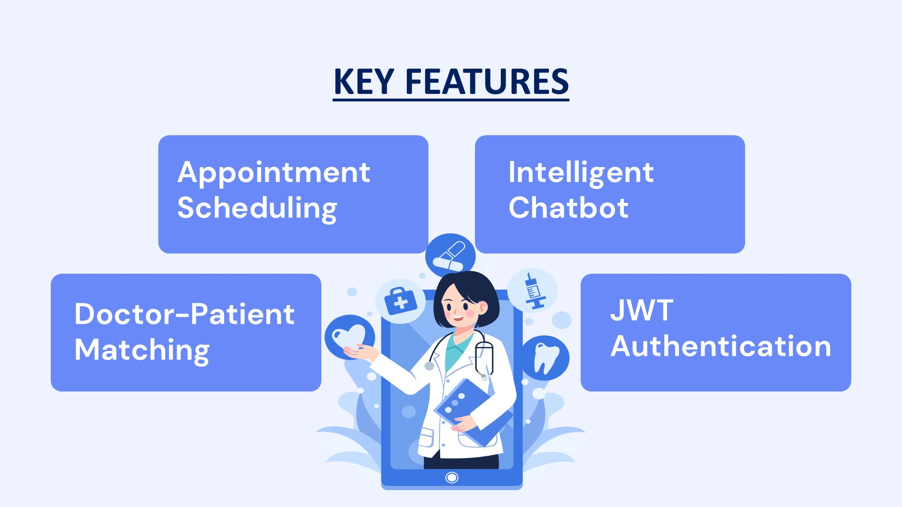
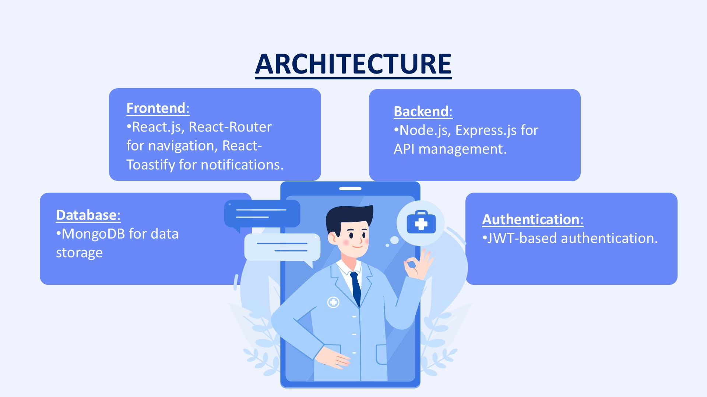
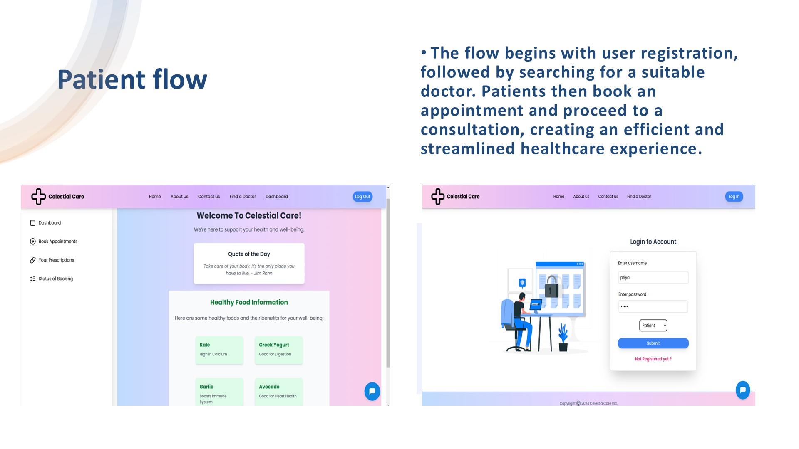
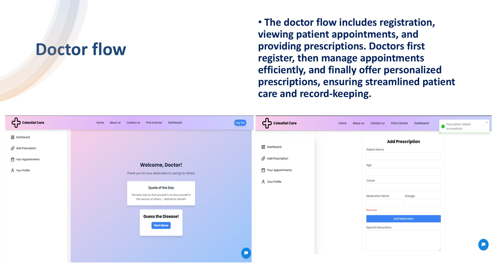
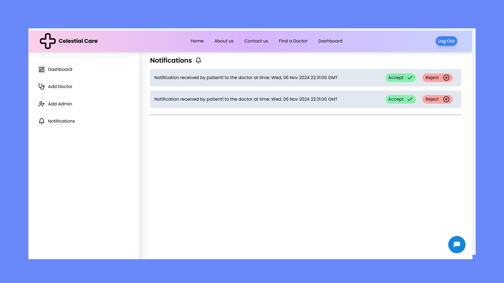
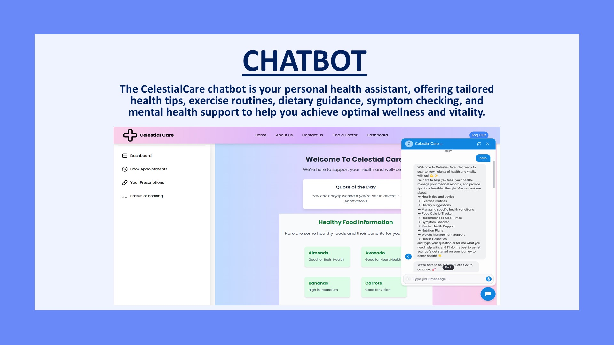

# 🏥 Celestial Care - Healthcare Management Platform

A comprehensive full-stack healthcare management platform designed to bridge the gap between patients and healthcare providers through intelligent appointment scheduling, doctor-patient matching, and AI-powered health assistance.


---

## 📸 Application Screenshots

### Key Features Overview


_Core platform capabilities: Appointment Scheduling, Intelligent Chatbot, Doctor-Patient Matching, and JWT Authentication_

---

### System Architecture


_MERN stack architecture with React frontend, Node.js/Express backend, MongoDB database, and JWT authentication_

---

### Patient User Flow


_Complete patient journey: Registration → Doctor Search → Appointment Booking → Consultation_

**Patient Dashboard & Login:**

- Clean, intuitive interface with navigation sidebar
- Secure JWT-based authentication
- Role selection (Patient) during registration
- Dashboard with Quote of the Day and health information
- Chatbot integration for instant support

**Doctor Discovery & Booking:**

- Browse doctors by specialization (Dermatology, etc.)
- View doctor profiles with ratings and specializations
- Real-time appointment booking with date/time selection
- Instant notifications for appointment status
- Pricing transparency (consultation fees displayed)

---

### Doctor User Flow


_Doctor workflow: Registration → Appointment Management → Prescription Management_

**Doctor Dashboard Features:**

- Personalized doctor dashboard with motivational quotes
- "Guess the Disease!" gamification element
- Quick access to prescription management
- View and manage patient appointments

**Appointment Management:**

- Today's appointments list with patient details
- Scheduled time slots with GMT timestamps
- Quick actions: Add Prescription, Mark as Completed
- Multiple patient management capability
- Real-time appointment tracking

**Prescription System:**

- Digital prescription creation interface
- Patient information (name, age, cause)
- Medication details (name, dosage)
- Special instructions field
- Success notifications upon prescription submission

---

### Admin Panel


_Admin notification system for appointment approval/rejection with Accept/Reject controls_

**Admin Features:**

- Centralized dashboard for system oversight
- User management (Add Doctor, Add Admin)
- Appointment approval workflow
- Real-time notification system
- Accept/Reject appointment requests
- System-wide monitoring capabilities

---

### AI-Powered Chatbot


_Intelligent health assistant providing personalized health tips, exercise routines, dietary guidance, symptom checking, and mental health support_

**Chatbot Capabilities:**

- 💬 Real-time conversational interface
- 🏥 Health tips and medical advice
- 🥗 Dietary guidance and nutrition plans
- 💪 Exercise routine recommendations
- 🩺 Symptom analysis and checking
- 🧠 Mental health support resources
- 📊 Health condition management
- 🍽️ Food calorie tracking
- 📅 Recommended meal times
- 🎓 Health education resources

---

## ✨ Key Features

### 🔐 Secure Authentication System

- **JWT-Based Authentication:** Industry-standard token-based security
- **Role-Based Access Control (RBAC):** Separate dashboards for Admin, Doctor, and Patient
- **Secure Password Handling:** Encrypted storage and secure transmission
- **Session Management:** Automatic token refresh and logout functionality

### 📅 Intelligent Appointment Scheduling

- **Real-Time Booking:** Instant appointment confirmation
- **Time Slot Management:** Conflict prevention and availability tracking
- **Automated Notifications:** Email/in-app alerts for appointments
- **Flexible Scheduling:** Multiple time slots and date selection
- **Appointment History:** Complete record of past and upcoming appointments

### 👨‍⚕️ Doctor-Patient Matching

- **Specialization-Based Search:** Find doctors by medical specialty
- **Rating System:** 5-star ratings and patient reviews
- **Doctor Profiles:** Detailed information about qualifications and experience
- **Smart Recommendations:** AI-powered doctor suggestions based on symptoms

### 🤖 Intelligent Health Chatbot

- **24/7 Availability:** Always-on health assistant
- **Symptom Analysis:** Preliminary health assessment
- **Health Tips:** Personalized wellness recommendations
- **Dietary Guidance:** Nutrition and meal planning advice
- **Mental Health Support:** Resources and coping strategies
- **Exercise Routines:** Custom workout recommendations

### 💊 Digital Prescription Management

- **E-Prescriptions:** Paperless prescription creation and storage
- **Medication Tracking:** Dosage and timing information
- **Prescription History:** Complete medical records
- **Special Instructions:** Custom notes for patients

### 🔔 Real-Time Notifications

- **Appointment Alerts:** Reminders and confirmations
- **Prescription Notifications:** New prescription alerts
- **System Updates:** Important announcements
- **Status Changes:** Real-time appointment status updates

### 🎨 Modern User Interface

- **Responsive Design:** Seamless experience across all devices
- **Intuitive Navigation:** Easy-to-use interface for all user types
- **Visual Feedback:** Toast notifications and status indicators
- **Accessibility:** WCAG-compliant design principles
- **Clean Aesthetics:** Professional healthcare-themed design

---

## 🚀 Tech Stack

### Frontend

- **React.js 18.2.0** - Component-based UI library
- **React Router DOM** - Client-side routing and navigation
- **React Toastify** - Toast notification system
- **Tailwind CSS** - Utility-first CSS framework
- **Material-UI** - React component library
- **Axios** - HTTP client for API requests

### Backend

- **Node.js** - JavaScript runtime environment
- **Express.js** - Web application framework
- **MongoDB** - NoSQL database for scalable data storage
- **Mongoose** - MongoDB object modeling
- **JSON Web Token (JWT)** - Secure authentication
- **Bcrypt.js** - Password hashing and encryption
- **Nodemailer** - Email notification service
- **Cors** - Cross-Origin Resource Sharing

### Additional Tools

- **Postman** - API testing and documentation
- **Git & GitHub** - Version control
- **VS Code** - Development environment

---

## 📋 User Workflows

### Patient Journey

1. **Registration/Login** → Secure account creation with role selection
2. **Browse Doctors** → Search by specialization, location, ratings
3. **View Profiles** → Check doctor credentials, availability, fees
4. **Book Appointment** → Select date, time, and confirm booking
5. **Receive Confirmation** → Get instant notification and appointment details
6. **Attend Consultation** → In-person or virtual consultation
7. **Access Prescription** → View and download digital prescriptions
8. **Track History** → Review past appointments and medical records

### Doctor Workflow

1. **Professional Registration** → Create doctor profile with credentials
2. **Dashboard Access** → View personalized doctor dashboard
3. **Manage Appointments** → See today's and upcoming appointments
4. **Review Patient Information** → Access patient details before consultation
5. **Conduct Consultation** → Provide medical advice and diagnosis
6. **Create Prescriptions** → Digital prescription with medication details
7. **Mark Completion** → Update appointment status
8. **Track Patient History** → Review past consultations and treatments

### Admin Operations

1. **System Login** → Secure admin authentication
2. **User Management** → Add/remove doctors, patients, admins
3. **Appointment Oversight** → Monitor all platform appointments
4. **Approval Workflow** → Accept/reject appointment requests
5. **Notification Management** → Handle system-wide alerts
6. **Analytics Dashboard** → View platform usage statistics
7. **System Maintenance** → Ensure smooth operation

---

## ⚙️ Installation & Setup

### Prerequisites

- **Node.js** (v14 or higher)
- **MongoDB** (Local installation or MongoDB Atlas)
- **npm** or **yarn**

### 1. Clone the Repository

```bash
git clone https://github.com/VEDITHREDDY26/HealthCare-Management.git
cd HealthCare-Management
```

### 2. Backend Setup

Navigate to backend directory and install dependencies:

```bash
cd backend
npm install
```

Create `.env` file in backend directory:

```env
PORT=5000
MONGO_URI=your_mongodb_connection_string
JWT_SECRET=your_jwt_secret_key
JWT_EXPIRE=7d
EMAIL_HOST=smtp.gmail.com
EMAIL_PORT=587
EMAIL_USER=your_email@gmail.com
EMAIL_PASS=your_email_app_password
NODE_ENV=development
```

Start the backend server:

```bash
npm run dev
```

Backend will run on `http://localhost:5000`

### 3. Frontend Setup

Navigate to frontend directory:

```bash
cd ../frontend
npm install
```

Create `.env` file in frontend directory:

```env
REACT_APP_API_URL=http://localhost:5000/api
REACT_APP_CHATBOT_API=your_chatbot_api_endpoint
```

Start the frontend:

```bash
npm start
```

Application will open at `http://localhost:3000`

---

## 📂 Project Structure

```
HealthCare-Management/
├── backend/
│   ├── config/
│   │   └── db.js                 # Database connection
│   ├── controllers/
│   │   ├── authController.js     # Authentication logic
│   │   ├── appointmentController.js
│   │   ├── doctorController.js
│   │   └── prescriptionController.js
│   ├── models/
│   │   ├── User.js               # User schema (Admin/Doctor/Patient)
│   │   ├── Appointment.js
│   │   ├── Doctor.js
│   │   └── Prescription.js
│   ├── routes/
│   │   ├── authRoutes.js
│   │   ├── appointmentRoutes.js
│   │   ├── doctorRoutes.js
│   │   └── prescriptionRoutes.js
│   ├── middleware/
│   │   ├── authMiddleware.js     # JWT verification
│   │   └── roleMiddleware.js     # Role-based access
│   ├── utils/
│   │   └── emailService.js       # Email notifications
│   └── server.js                 # Entry point
│
├── frontend/
│   ├── public/
│   ├── src/
│   │   ├── components/
│   │   │   ├── Auth/
│   │   │   │   ├── Login.jsx
│   │   │   │   └── Register.jsx
│   │   │   ├── Patient/
│   │   │   │   ├── PatientDashboard.jsx
│   │   │   │   ├── DoctorSearch.jsx
│   │   │   │   └── BookAppointment.jsx
│   │   │   ├── Doctor/
│   │   │   │   ├── DoctorDashboard.jsx
│   │   │   │   ├── AppointmentList.jsx
│   │   │   │   └── AddPrescription.jsx
│   │   │   ├── Admin/
│   │   │   │   ├── AdminDashboard.jsx
│   │   │   │   └── Notifications.jsx
│   │   │   └── Chatbot/
│   │   │       └── HealthChatbot.jsx
│   │   ├── context/
│   │   │   └── AuthContext.js
│   │   ├── utils/
│   │   │   └── api.js
│   │   ├── App.jsx
│   │   └── index.js
│   └── package.json
│
├── screenshots/                   # Application screenshots
└── README.md
```

---

## 🔒 Security Features

- **JWT Authentication:** Stateless, secure token-based authentication
- **Password Encryption:** Bcrypt hashing with salt rounds
- **HTTPS Support:** Encrypted data transmission
- **Input Validation:** Server-side validation for all user inputs
- **SQL Injection Prevention:** Mongoose query sanitization
- **XSS Protection:** Content Security Policy headers
- **CORS Configuration:** Controlled cross-origin requests
- **Rate Limiting:** API request throttling
- **Secure Headers:** Helmet.js security headers

---

## 🎯 API Endpoints

### Authentication

- `POST /api/auth/register` - User registration
- `POST /api/auth/login` - User login
- `GET /api/auth/profile` - Get user profile (Protected)
- `PUT /api/auth/profile` - Update profile (Protected)

### Appointments

- `GET /api/appointments` - Get user appointments (Protected)
- `POST /api/appointments` - Create appointment (Protected - Patient)
- `PUT /api/appointments/:id` - Update appointment (Protected)
- `DELETE /api/appointments/:id` - Cancel appointment (Protected)
- `PATCH /api/appointments/:id/status` - Update status (Protected - Doctor/Admin)

### Doctors

- `GET /api/doctors` - Get all doctors
- `GET /api/doctors/:id` - Get doctor by ID
- `GET /api/doctors/specialization/:spec` - Get by specialization
- `POST /api/doctors` - Add doctor (Protected - Admin)
- `PUT /api/doctors/:id` - Update doctor (Protected - Admin/Doctor)

### Prescriptions

- `GET /api/prescriptions` - Get user prescriptions (Protected)
- `POST /api/prescriptions` - Create prescription (Protected - Doctor)
- `GET /api/prescriptions/:id` - Get prescription details (Protected)

### Admin

- `GET /api/admin/users` - Get all users (Protected - Admin)
- `POST /api/admin/users` - Add user (Protected - Admin)
- `DELETE /api/admin/users/:id` - Delete user (Protected - Admin)
- `GET /api/admin/notifications` - Get notifications (Protected - Admin)

---

## 📊 Research & Publication

This project has been co-authored in a **peer-reviewed research paper** validating the platform's:

- ✅ **Scalability** - Handles concurrent users efficiently
- ✅ **Security** - Robust authentication and data protection
- ✅ **Performance** - Optimized response times and database queries
- ✅ **Real-World Viability** - Tested in healthcare environment scenarios

_Publication details available upon request_

---

## 🔮 Future Enhancements

- [ ] **Telemedicine Integration** - Video consultation capabilities
- [ ] **AI-Driven Diagnostics** - Advanced symptom analysis and disease prediction
- [ ] **E-Prescription & Pharmacy Integration** - Direct pharmacy connectivity
- [ ] **Medical Records Management** - Complete EHR/EMR system
- [ ] **Payment Gateway** - Online payment processing
- [ ] **Insurance Integration** - Insurance verification and claims
- [ ] **Mobile Application** - React Native iOS/Android apps
- [ ] **Multi-language Support** - Internationalization
- [ ] **Wearable Device Integration** - Health data from fitness trackers
- [ ] **Emergency Services** - Urgent care and ambulance booking
- [ ] **Lab Test Booking** - Diagnostic test scheduling
- [ ] **Medicine Reminder** - Automated medication alerts

---

## 🐛 Troubleshooting

### Common Issues

**Issue: MongoDB connection fails**

- Verify MongoDB is running: `mongod --version`
- Check connection string in `.env`
- Ensure network access in MongoDB Atlas whitelist

**Issue: JWT token errors**

- Verify JWT_SECRET is set in `.env`
- Check token expiration time
- Clear browser localStorage and login again

**Issue: Email notifications not working**

- Use Gmail app-specific password (not regular password)
- Enable "Less secure app access" in Google account
- Verify EMAIL_HOST and EMAIL_PORT settings

**Issue: Chatbot not responding**

- Check REACT_APP_CHATBOT_API endpoint
- Verify API key is valid
- Check browser console for CORS errors

---

## 📚 Learning Outcomes

Through developing this healthcare platform, I gained expertise in:

- **Full-Stack MERN Development** - End-to-end application architecture
- **Healthcare Domain Knowledge** - Medical workflows and HIPAA considerations
- **Role-Based Access Control** - Complex authorization systems
- **Real-Time Systems** - WebSocket integration for live updates
- **Security Best Practices** - Healthcare data protection standards
- **API Design** - RESTful architecture and documentation
- **Database Optimization** - MongoDB indexing and query performance
- **State Management** - React Context API for global state
- **Research Methodology** - Academic paper writing and peer review process

---

## 🤝 Contributing

Contributions are welcome! Please follow these steps:

1. Fork the repository
2. Create your feature branch (`git checkout -b feature/AmazingFeature`)
3. Commit your changes (`git commit -m 'Add some AmazingFeature'`)
4. Push to the branch (`git push origin feature/AmazingFeature`)
5. Open a Pull Request

---

## 👤 Author

**Vedith Reddy Kommula**

- Email: vedithreddykommula@gmail.com
- LinkedIn: [LinkedIn Profile](https://linkedin.com/in/vedithreddykommula)
- GitHub: [@VEDITHREDDY26](https://github.com/VEDITHREDDY26)

---

## 🙏 Acknowledgments

- **MongoDB** for scalable database solutions
- **React** community for comprehensive documentation
- **Node.js** for robust backend capabilities
- **Healthcare professionals** who provided domain insights
- **Research collaborators** for peer review and validation

---

## 📄 License

This project is open source and available under the [MIT License](LICENSE).

---

## 📧 Contact

For questions, collaborations, or healthcare IT opportunities:

- **Email:** vedithreddykommula@gmail.com
- **GitHub Issues:** [Report an issue](https://github.com/VEDITHREDDY26/HealthCare-Management/issues)

---

**Built with ❤️ to improve healthcare accessibility**

_Empowering patients and healthcare providers through innovative technology solutions._
